##   tsconfig.json
父子类型的转换注意一下

### 控制输入输出文件

```json
    "outDir": "./dist",   
	"rootDir": "./src",      
```

tsc运行即可

## 类型

把值定义为父类，则可以接收他所有的子类类型。 

### Object(注意大小写)

Object类型不能赋值null\undefined

{}即Object

```ts
let cc:Object  = 45 // true
let dd:object  = 45 //false
```

### any&unknow

#### 1、赋值

any可以是任何类型的子类

```ts
let aaa:any='234234'
let b:number = aaa//right
```

unknow不能赋值给已知

```ts
let aaa:unknown='234234'
let b:number = aaa//error
```

#### 2、获取属性

可以任意传入数据，但使用时unknow不能取属性

```ts
function go(data:any){
    console.log(data.money);//true   
}
function go(data:unknow){
    console.log(data.money);//false
}
```

### 可索引签名

``[key:string]``可为string以外的其他值

```ts
interface INAME  {name:string,age:number,[key:string]:any}
let obj:INAME={
    name:'name',
    age:126,
    1:'abc',
    true:12
}
```

typeof跟的是变量、keyof跟类型

```ts
const symid = Symbol('someid')
interface INAME  {
    name:string,
    age:number,
    [symid]:number,
    [key:string]:any
}
type B = INAME['name']
type C = INAME['age']

type D = INAME[symid] // error
type F = INAME[typeof symid] //right

```

```ts
const symid = Symbol('someid')
interface INAME  {
    name:string,
    age:number,
    [symid]:number,
}

type G = keyof INAME // “name”|"age"|typeof symid
```

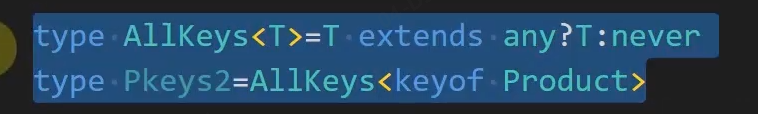

能接收undefined的值

目前只有any\undefined\unknow

### interface&type

- interface只能定义对象类型或函数类型
- interface可以使用extends
- type交叉类型
- interface可以合并申明

### 可变元组

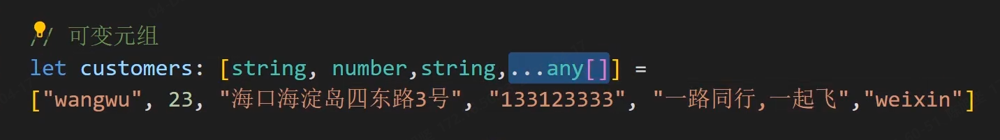

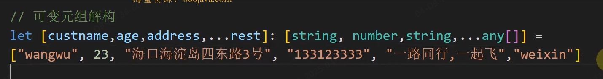

### class

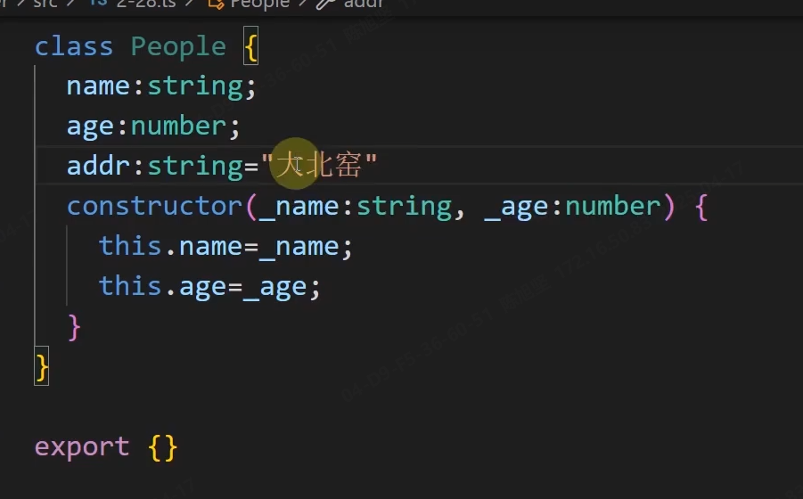

静态成员....

静态方法

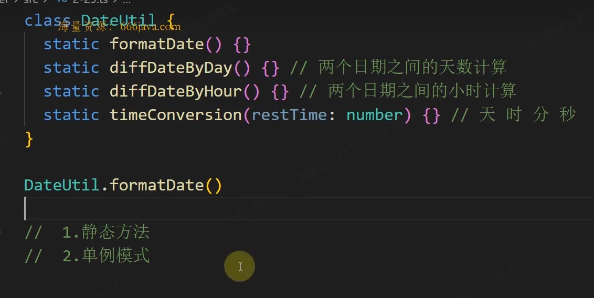

静态成员实现单例模式 

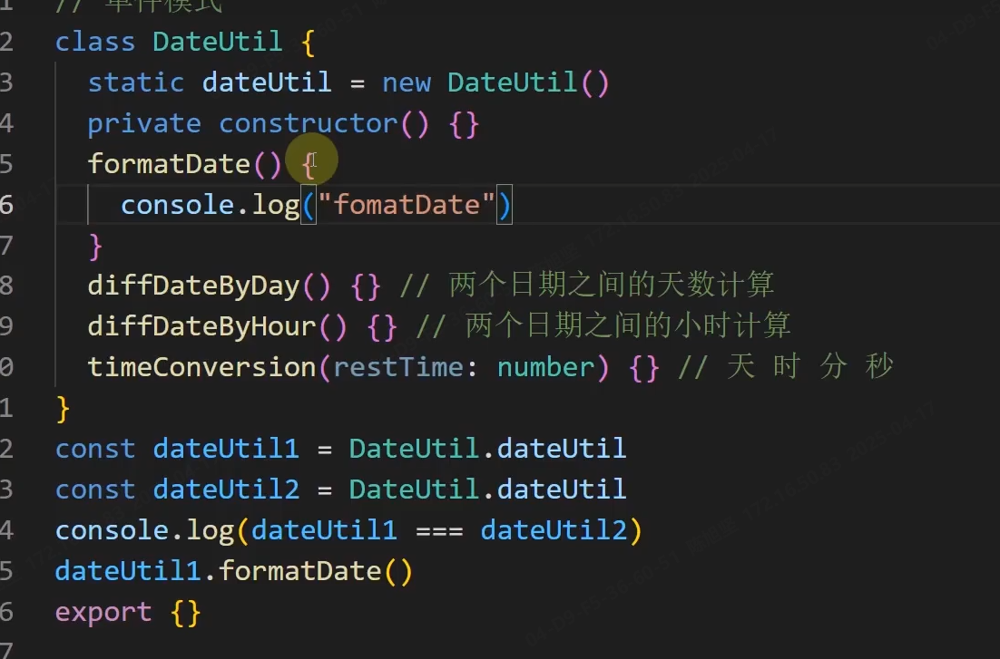

## 底层

### 枚举

类似下方,用如下方式完成双向映射

```js
const week1 = ((week)=>{
    week[week['moday']=1] = 'monday'
    return week
})(week={})
console.log(week1)
```

```ts
enum week1 = {
    monday
}
week1.monday//1
week1[1]//'monday '
```

## 属性拦截

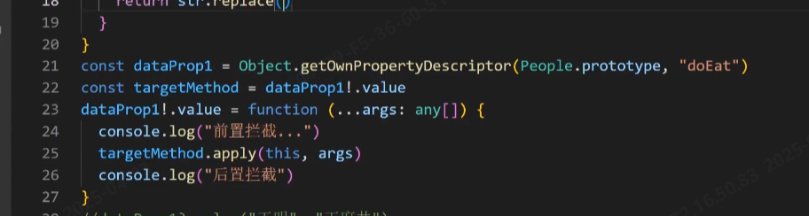


##  tsconfig.json

四个基本选项

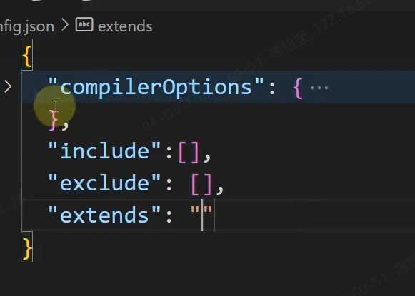


   

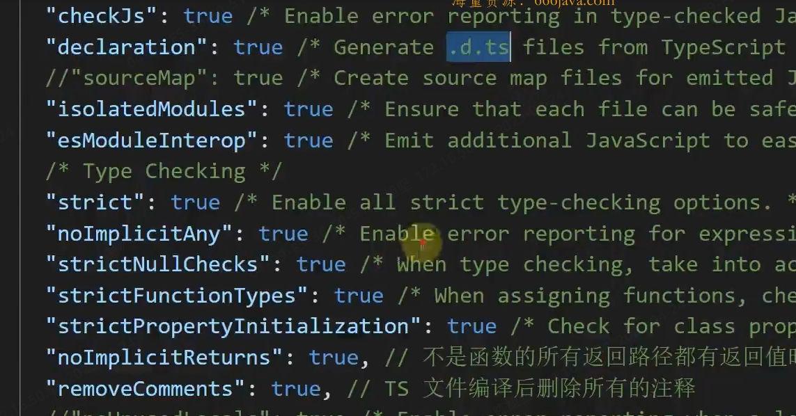

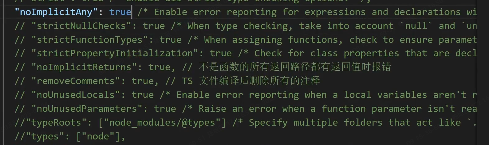

noImplicitAny 不能有未声明的any

noImplictReturns 不能有未确定的返回


skipLibcheck:true  跳过声明类型文件检查  .d.ts

jsx:"preset" 支持jsx语法（react-native等值）


装饰器选项

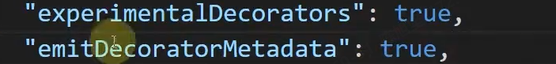

别名映射

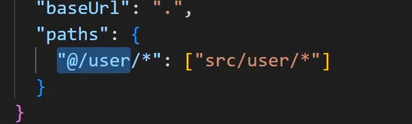

include类型指定的搜索范围 

## 类型守卫

杂七杂八

```js
class Animal
class Dog extends Animal
class Tiger extends Animal

function say(data:Animal){} 
//等价于 
function say(data:Dog|Tiger){}
```

### instanceof

```js
class Animal
class Dog extends Animal
class Tiger extends Animal

function say(data:Dog|Tiger){
    // 可以有效得到dog的方法提示
    if(data instanceof Dog){
        data.say()
    }
    
} 
```

### in

 ```js
class Animal
class Dog extends Animal
class Tiger extends Animal

function say(data:Dog|Tiger){
    // 可以有效得到tigger的方法提示
    if('tiggerSay' in data){
        data.say()
    }
    
} 
 ```

### typeof


### 自定义守卫

```ts
class Fish{
    swim(){}
}
class Bird{
    fly(){}
} 
function go(action:Fish|Bird){
    if(isFish(action))
    action.swim()
}
function isFish(data:any):data is Fish{
    return data instanceof Fish
}
```

 索引方式获取类型中某个值

```js
interface Go{
    go:string
}
let dddd:Go['go']='a'
```


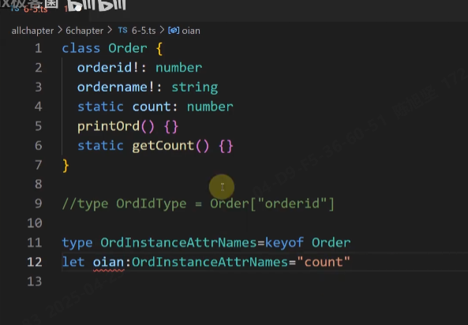

## 类型约束

```ts
T extends Peopleb  
```

就只能是Torder里的值

```js
type Torder={
    id:string,
    title:string
}
type TTypesKey<T extends object>=keyof T
const data:TTypesKey<Torder>='id' //约束他
```


比较排序 小于0就是arr1在前

```js
let arr1="陈某"
let arr2="李某"
arr1.localeCompare(arr2,'zh-CN')
```

## 合并交叉类型

```ts
function cross<T extends object, U extends object>(obj1:T,obj2:U):T&U{
    const combined= {} as T&U 
    union(combined,obj1)
    union(combined,obj2)
    return combined
}
function union(combined:any,curobj:any){
    for(let key in curobj) combined[key] = curobj[key]
    return combined
}
```

## infer

vue中用于unref 

```ts
interface Iparams{
    params1:string;
    params2:number;
}
type Tfn1 = (params:Iparams)=>void;
// 获取params类型
type Tfn1Params = Tfn1 extends (params:infer P)=>any ? P :Tfn1;
// 获取返回值类型
type Treturn = Tfn1 extends (params:any)=>infer R ? R :Tfn1;

// 封装一下
type TGetParams<T> = T extends (params:infer P)=>any ? P :T;
type TGetReturn<T> = T extends (params:any)=>infer R ? R :T;
type Tfn1P = TGetParams<Tfn1>;
type Tfn1R = TGetReturn<Tfn1>;

// 获取数组类型
type TGetArrayType<T> = T extends (infer P)[] ? P :T;
type TImtem = TGetArrayType<{name:string,age:number}[]>;

let someSubject = new Set([chineseSubject,mathSubject])
type TGetSubject<T> = T extends Set<infer P> ? P :T;
```

## 类型体操

### in keyof

keyof 拿的是对象的所有key

in 拿的是他其中的任意一个

```ts
interface Iparams{
    params1:string;
    params2:number;
}
// keyof 获取其中所有类型
type TCustKey = {
    [P in keyof Iparams]:  Iparams[P]
}

```

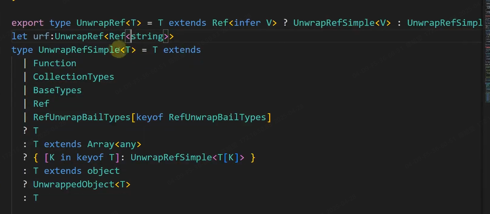


```ts
type A = {age:number,name:string}
type B = {age:number,title:string}
type MT = keyof (A|B) // ‘age’ 读取的是两个共有的一个key
```


## 条件类型

易混淆的点(与下方Extract对应)

要分布判断的话必须通过泛型

```ts
type Test = string | number extends string|number| boolean?string:never // string
type TGetType<T> = T extends string | number | boolean ? T : never
type Test2 = TGetType<string | number > // string | number
```

优化function中的类型约束

```ts
/* function cross<T extends object,U extends object>(obj1:T,obj2:U):string
function cross<T extends object,U extends object,Z extends object>(obj1:T,obj2:U,obj3:Z):number
function cross<T extends object,U extends object,Z extends object>(obj1:T,obj2:U,obj3?:Z):any{
    if(obj3) return 1
    return '1'
}
let one = cross({},{})
let two = cross({},{},{}) */


// 与上方效果一致 但翻遍修改
type Tcross<T> = T extends object ? T : never
function cross<T ,U >(obj1:Tcross<T>,obj2:Tcross<U>):string
function cross<T ,U ,Z >(obj1:Tcross<T>,obj2:Tcross<U>,obj3:Tcross<Z>):number
function cross<T ,U ,Z >(obj1:Tcross<T>,obj2:Tcross<U>,obj3?:Tcross<Z>):any{
    if(obj3) return 1
    return '1'
}
let one = cross({},{})
let two = cross({},{},{})
```

## 扁平化数据

```js
type Modules = {
    menu:{
        setA:(index:string)=>string
        setB:(index:string)=>string
    },
    tabs:{
        setC:(index:string)=>string
        setD:(index:string)=>string
    }
}

// 模板字符类型
type MB<T,U> = `${T & string}/${U & string}`
type TestMB1 = MB<'menu','setA'|'setB'>

// type TModulesSpliceKeys<T>={
//     [Key in keyof T]:T[Key]
// }
type ModulesSpliceKeys<T> = {
    [Key in keyof T]:MB<Key,keyof T[Key]>
}[keyof T]
//[keyof T]舍掉属性 拿到值
type TestModulesSpliceKeys = ModulesSpliceKeys<Modules>
```

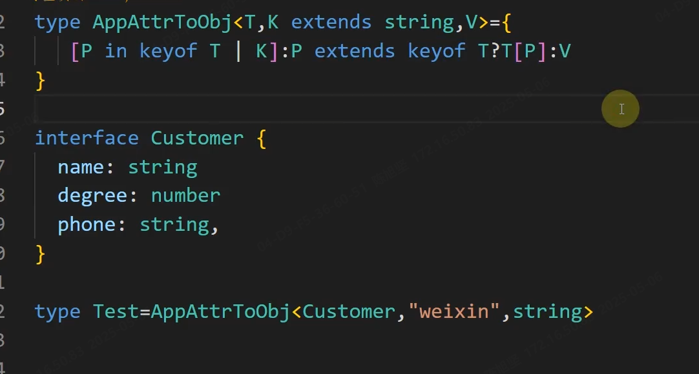

## Extract&Exclude:条件类型的简写

底层

```js
type Extract<T, U> = T extends U ? T : never;//拿到继承于后方的
type Exclude<T, U> = T extends U ? never : T;//拿到不继承于后方的
```

```js
 type TestExtract = Extract<string | number | boolean,string|number>
```

对照上方的条件类型

```js
export type Tcross<T> = Extract<T,object>

function cross<T ,U >(obj1:Tcross<T>,obj2:Tcross<U>):string
function cross<T ,U ,Z >(obj1:Tcross<T>,obj2:Tcross<U>,obj3:Tcross<Z>):number
function cross<T ,U ,Z >(obj1:Tcross<T>,obj2:Tcross<U>,obj3?:Tcross<Z>):any{
    if(obj3) return 1
    return '1'
}
```

exclude的实际使用：看一下下方的in 高级

## 解决keyof无法直观展示问题

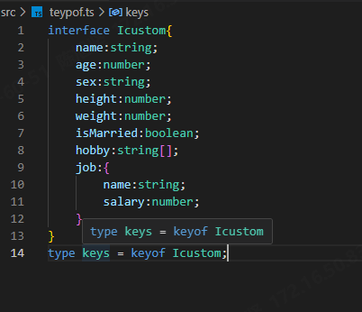

因为泛型有分布比较的功能

```js
interface Icustom{
    name:string;
    age:number;
    sex:string;
    height:number;
    weight:number;
    isMarried:boolean;
    hobby:string[];
    job:{
        name:string;
        salary:number;
    }
}

type DirectKey<T> =  T extends any ?  T :never
type keys2 = DirectKey<keyof Icustom>
```

## 理解Record

``Record<string,any>``支持数组，对象   

理解P in K

```js
export type Record<K extends keyof any, T> = {
    [P in K]: T;
};
```

### in基本使用

```js
type Tin = {
    [key in 'name'|'age']:string
}
let student:Tin = {
    name:'张三',
    age:'18',
    // obj:'sdff'//error
}
```

### in高级

  后面这个as很关键，可以把所有类型给带出来

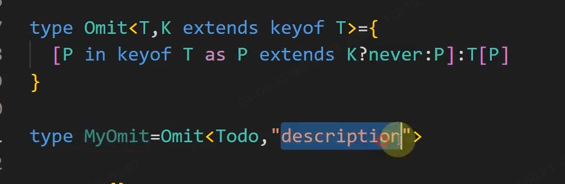

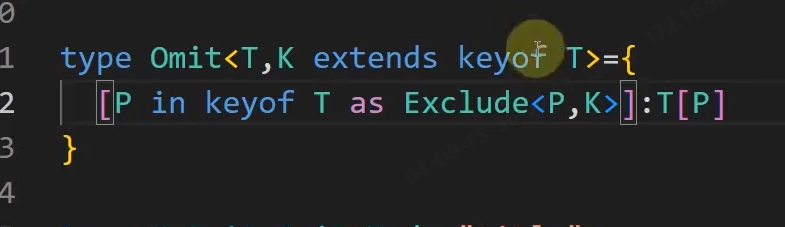


## 提取一些类型（如fn）

### Capitalize: 首字母大写

```ts
interface Idog{
    name:string
    age:number
    shut():void
    run():void
}
type TFn<T>={
    [P in keyof T as T[P] extends Function?P:never]:T[P]
}
type TIdog = TFn<Idog>
// 加上前缀 
type TPrefixFn<T>={
    [P in keyof T as T[P] extends Function?`do${Capitalize<P & string>}`:never]:T[P]
}
type TPrefixDo = TPrefixFn<Idog>
```

## 辅助类型

Readonly&Required&Partial

将可选属性改为必填Required对应Partical

```ts
interface obj{
    name:string,
    age:number,
    address?:string
}
type Required<T>={
    [K in keyof T]-?:[T[K]]
}
type AllObj = Required<obj>
```


```ts
interface obj{
    readonly name:string,
    age:number,
    address?:string
}

type allWrite<T>={
    -readonly [K in keyof T]:T[K]
}
type objWrite =  allWrite<obj> // 去除所有readonly限制
```

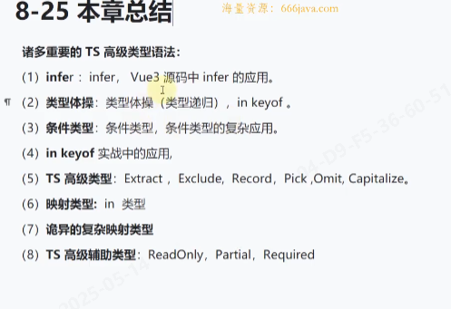


## 声明文件

接口和类型不需要接上declare

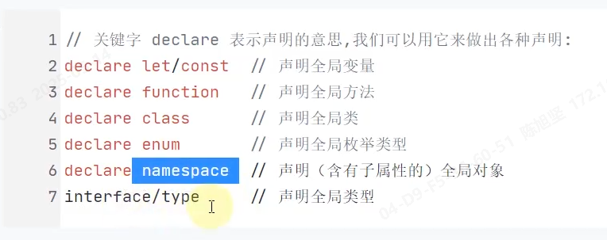

级联效果实现

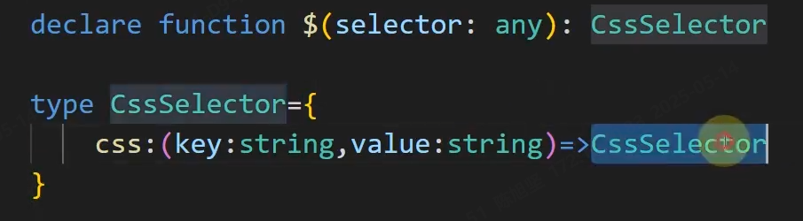

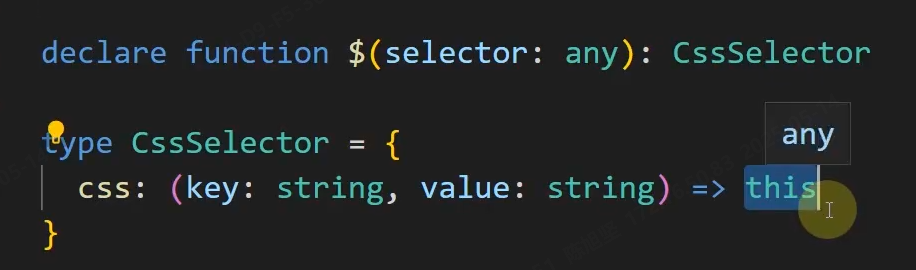 

### 命名空间使用

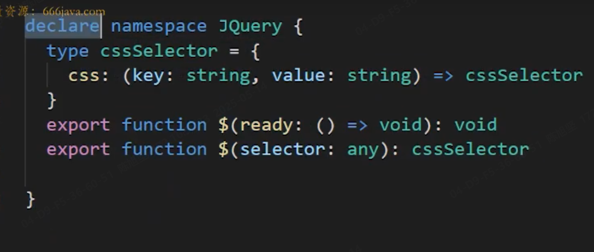

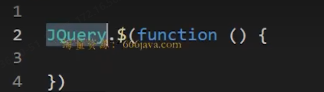

### 导出模块

data.d.ts

```ts
declare module "space1"{
     export function go(data:number):void
}
```

a.ts

```ts
import space1 from 'space1' 
space1.go(8989)
```

若导出一个类可如下写

data.d.ts

```ts
declare module "space1"{
      function go(data:number):void
      export = go
}
```

```ts
import go from 'space1' 
go(8989)
```

## 装饰器

// 装饰器顺序 属性-》(参数-》方法)-》构造器参数装饰器 -》类


使用场景：添加日志

tsconfig.json打开装饰器限制

```json
"experimentalDecorators": true,                   /* Enable experimental support for legacy experimental decorators. */
"emitDecoratorMetadata": true,
```

### 类装饰器

#### 泛型工程类继承装饰器

```ts
function FirstDesc<T extends {new(...args:any):any}>(cus:T) {
    return class  extends cus{
        constructor(...args:any[]){
            super(args)
            console.log('日志信息',cus.name);
        }
    }
}


@FirstDesc
export class CustomerServices {
    constructor(public name:string) { 
        console.log(this.name);
        
    }
    buy() {
        console.log(this.name + '购买');
    }
    placeOrder() {
        console.log(this.name + '下单购买');

    }
}
new CustomerServices('名字')

```

#### 方法装饰器

```ts
/**
 * 
 * @param targetClassPrototype 
 * @param methodname 
 * @param methodDecri 
 */
function fnDesc(targetClassPrototype:any,methodname:string,methodDecri:TypedPropertyDescriptor<any>){
    console.log("🚀 ~ fnDesc ~ targetClassPrototype:", targetClassPrototype)
    console.log("🚀 ~ fnDesc ~ methodname:", methodname)
    console.log("🚀 ~ fnDesc ~ methodDecri:", methodDecri)
    methodDecri.value()

}
class CustomerServices {
    constructor(public name:string) { 
        console.log(this.name);
        
    }
     
    @fnDesc
    buy() {
        console.log(this.name + '购买');
    }
    placeOrder() {
        console.log(this.name + '下单购买');

    }
}
export {}
```


拦截获取某个类

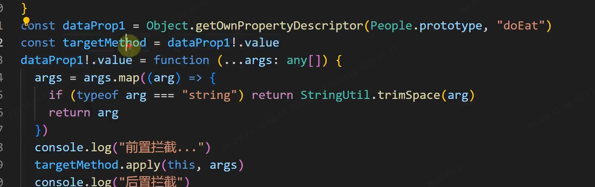

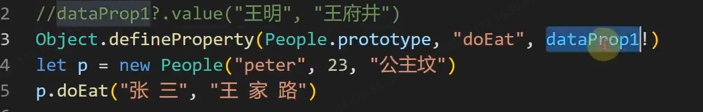

#### 属性装饰器

参数，类的原型，属性名


## 使用元数据

为了帮助类、方法属性实现一定功能而附加的数据

```js
pnpm add reflect-meatdata -D
```

自定义元数据、内置元数据


```ts

import 'reflect-metadata'

class userService {
    name: string = '名字'
    public login() {
        console.log(this.name + '登录');

    }
}

type MyPropDecorator = (target: any, key: string | symbol) => void
// propertyDecorator
function Inject(injectid: string): MyPropDecorator {
    return (target, key) => {
        // 拿到这个装饰器上修饰这个属性的类型
        let propClass = Reflect.getMetadata("design:type", target, key)
        const propClassObj = new propClass()
    }
}

type TMyMethodDecorator = (target: any, methodName: string, dataProps: PropertyDescriptor) => void
function get(path: string): TMyMethodDecorator {
    return (targetPrototype, methodName, dataProps) => {
        // 原型方法上定义一个元数据path
        Reflect.defineMetadata("path", path, targetPrototype, methodName)
        console.log("🚀 ~ return ~ methodName:", methodName)
        console.log("🚀 ~ return ~ targetPrototype:", targetPrototype)
        console.log("🚀 ~ return ~ path:", path)
    }
}

// 控制器装饰器获取装饰器上定义的元数据--此处是login22到login上
function Controller(rootPath: string) {
    return function <T extends { new(...args: any): any }>(targetClass: T) {
        console.log("🚀 ~ <Textends{new ~ targetClass.prototype:", targetClass.prototype)
        // tsconfig中的target改为es5才能够执行
        Object.keys(targetClass.prototype).forEach(methodName => {
            const result = Reflect.getMetadata("path",targetClass.prototype,methodName)
            console.log("🚀 ~ Object.keys ~ methodName:", result)
        })
    }
}

@Controller('/')
class UserController {
    @Inject("userService")
    private userService?: userService

    @get("/login22")
    public login(): void {

    }
}


```

## 参数装饰器


## 构造器参数装饰器

这里的target是类 其他装饰器是原型

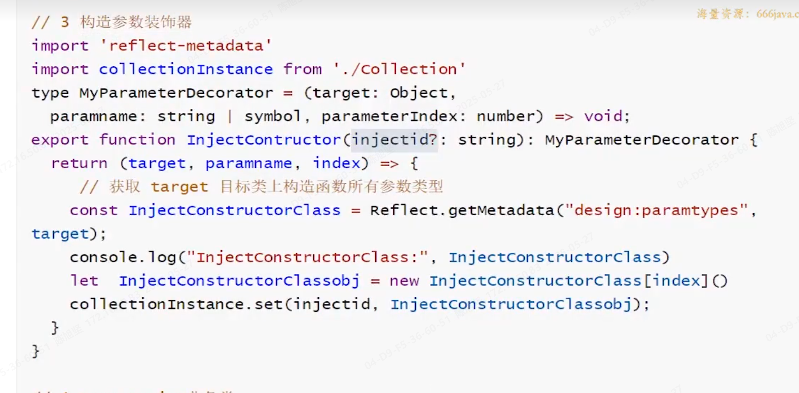

getMetadata将构造器上的参数类型拼装成数组

使用

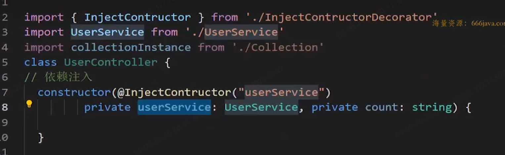

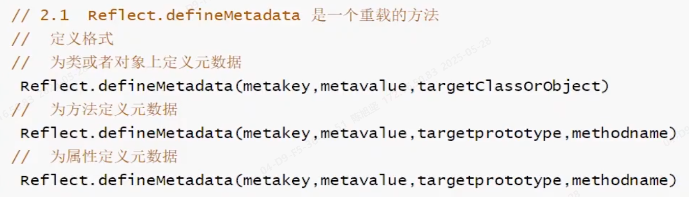


### :boxing_glove: 直接定义 

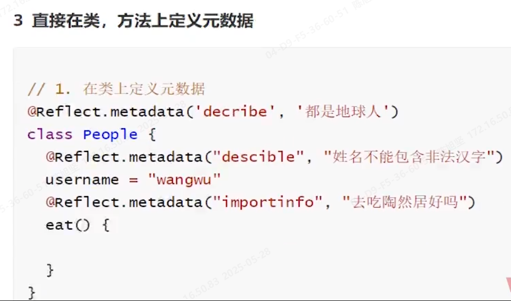


### :arrow_down_small: 获取所有元数据（方法）

 Reflect.getMetadataKeys(People.prototype,"getFullName")

以下三个原有的两个自定义的

返回类型，参数类型，方法类型（此处为function）

属性的话内置只有design:type

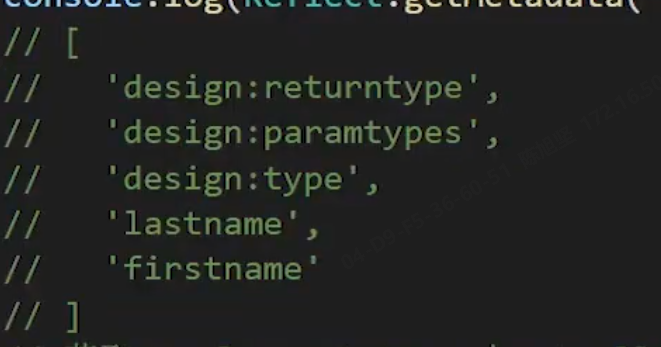

## :basketball_woman: nest中依赖注入

创建与使用分离

依赖注入：外部创建好 然后在里面使用。即赋值，外部给内部属性赋值inject

#  部分实战场景

## :ballot_box_with_check: 去除尾巴tail

```ts
type RemoveTail<S extends string,tail extends string> = 
S extends `${infer P}${tail}`?P:S

export let data: RemoveTail<'gogo/data/:data2','/:data2'>
let data2: RemoveTail<'gogo/data/:data2',`/${string}`>
```

